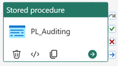
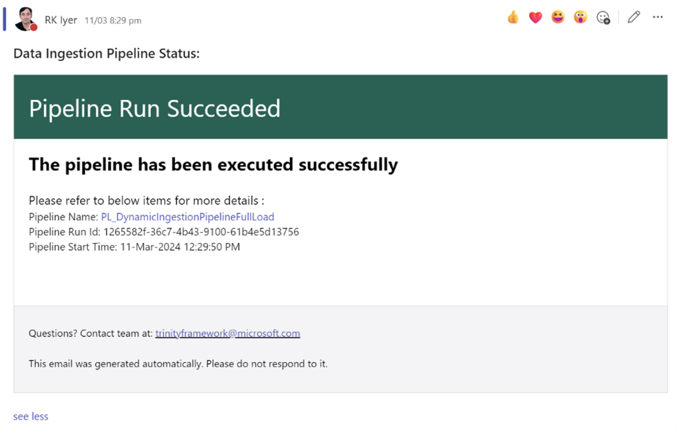
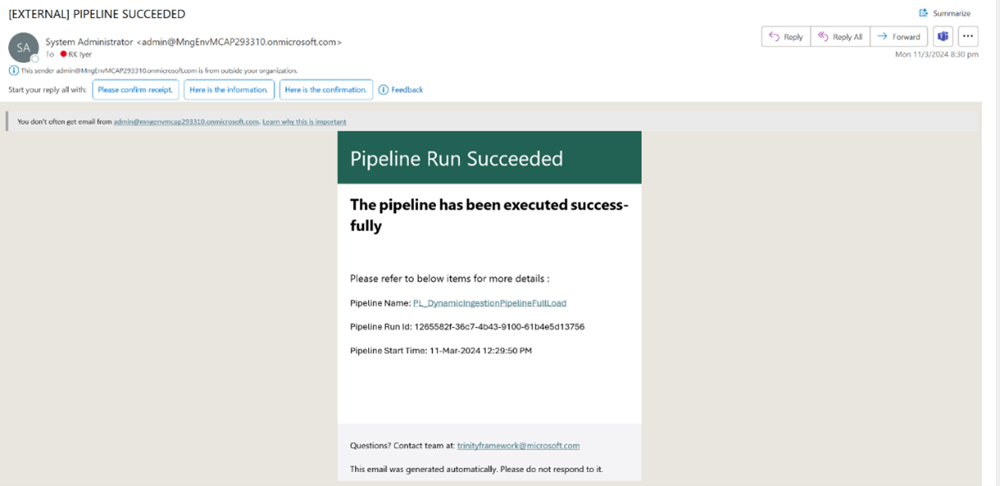

## Automated Fabric Data Pipelines Deployment - Azure PostgreSQL to Fabric Lakehouse

### Overview
This folder provides a simple-to-use metadata-driven framework to ingest data tables from a source database (PostgreSQL) to a Fabric Lakehouse. Please check out the implementation document [insert document link] for a step by step guide to set up these pipelines. 

The Metadata Driven Data Ingestion Framework Components comprises of the following components:

### Implementation

For step by step implementation instructions, please refer to the step-by step guide document.

### Scope
This version of the repo includes below data pipelines:

•	These pipelines are designed to be modular so that these can be executed independently. 

•	This document covers the steps to deploy these pipelines in your Fabric workspace.

### Pipeline definitions 

#### Populate Metadata Table Pipeline
•	Pipeline Name: PL_PopulateMetadataTable_PG 

•	Description: This pipeline will help in creating and populating the metadata in control table in Data Warehouse. This control table will be used for metadata driven data ingestion. Below is the screenshot of the pipeline activities.

#### Dynamic Ingestion Pipeline - Full Load
•	Pipeline Name: PL_DynamicIngestionPipelineFullLoad_PG

•	Description: This pipeline is used for full load to Lakehouse. This will invoke auditing and mail notification in case of success or failure. Below is the screenshot of the pipeline activities.

#### Dynamic Ingestion Pipeline Incremental Load
•	Pipeline Name: PL_DynamicIngestionPipelineIncreLoad_PG

•	Description: This activity will iterate over all the objects fetched from the control table during incremental load. This will invoke auditing and mail notification in case of success or failure. Below is the screenshot of the pipeline activities.

#### Auditing Pipeline
•	Pipeline Name: PL_Auditing_PG

•	Description: This pipeline facilitates auditing of the records ingested into data lake. Auditing includes identifying any errors or issues that may have occurred during the process, as well as reviewing performance metrics to identify areas for improvement. Below is the screenshot of the pipeline activities.

#### Send Email Notification Pipeline
•	Pipeline Name: PL_SendEmailNotification_PG

•	Description: This pipeline sends email/Teams notification on success or failure. This will invoke Microsoft Teams & Email activity. Below is the screenshot of the pipeline activities.

#### Pipeline Monitoring and Notifications
Teams notification:

Email notification:

