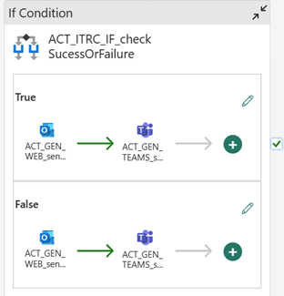
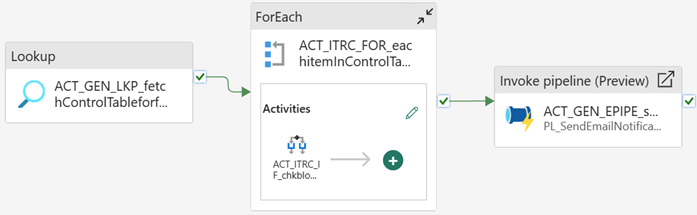
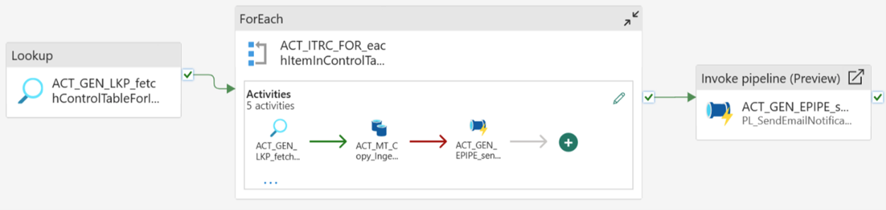

## Automated Fabric Data Pipelines Deployment - Azure PostgreSQL to Fabric Lakehouse

### Overview
This folder provides a simple-to-use metadata-driven framework to ingest data tables from a source database (PostgreSQL) to a Fabric Lakehouse. Please check out the implementation document [insert document link] for a step by step guide to set up these pipelines.

### Pre-requisites
- Microsoft Azure Tenant with an active subscription 
- Fabric Capacity – F2 / Trial
- [Azure SQL Database](https://learn.microsoft.com/training/modules/provision-azure-sql-db/3-create-your-database) (for storing the metadata)

- [Azure PostreSQL for flexible server](https://learn.microsoft.com/azure/postgresql/flexible-server/quickstart-create-server?tabs=portal-create-flexible%2Cportal-get-connection%2Cportal-delete-resources)


### Implementation
For step by step implementation instructions, please refer to the step-by step guide document.
1. Set-up Metadata Store DB - Create Azure SQL Database 'metadatadb'.
2. Connect to 'metadatadb' using Query editor.Run the below script. This script creates two tables and one stored procedure under mtd schema.
```
USE metadatadb
GO

CREATE SCHEMA mtd
GO

CREATE TABLE [mtd].[ingest_audit](
	[source_type] [varchar](20) NULL,
	[event_run_id] [varchar](50) NULL,
	[event_activity_run_id] [varchar](50) NULL,
	[item_name] [varchar](150) NULL,
	[data_read] [bigint] NULL,
	[data_written] [bigint] NULL,
	[files_read] [int] NULL,
	[files_written] [int] NULL,
	[rows_read] [bigint] NULL,
	[rows_written] [bigint] NULL,
	[data_consistency_verification] [varchar](50) NULL,
	[copy_duration] [int] NULL,
	[event_start_time] [datetime2](6) NULL,
	[event_end_time] [datetime2](6) NULL,
	[source_cutoff_time] [datetime2](6) NULL,
	[load_type] [varchar](100) NULL,
	[status] [varchar](20) NULL,
	[event_triggered_by] [varchar](20) NULL,
	[error_details] [varchar](1500) NULL,
	[pipeline_url] [varchar](500) NULL
) ON [PRIMARY]
GO

CREATE TABLE [mtd].[ingest_control](
	[control_id] [int] IDENTITY(1,1) NOT NULL,
	[source_type] [varchar](20) NOT NULL,
	[source_container_name] [varchar](50) NULL,
	[source_folder_path] [varchar](100) NULL,
	[source_database_name] [varchar](100) NULL,
	[source_schema_name] [varchar](50) NULL,
	[source_table_name] [varchar](100) NULL,
	[source_column_list] [varchar](1000) NULL,
	[source_watermark_column] [varchar](100) NULL,
	[source_cutoff_time] [datetime2](6) NULL,
	[target_object] [varchar](100) NOT NULL,
	[load_type] [varchar](100) NOT NULL,
	[fabric_store] [varchar](50) NOT NULL,
	[enable_flag] [int] NOT NULL
) ON [PRIMARY]
GO

CREATE PROCEDURE [mtd].[capture_audit_event_sp] 
@source_type VARCHAR(20),
@event_run_id VARCHAR(50),
@event_activity_run_id VARCHAR(50) = NULL,
@item_name VARCHAR(150),
@data_read bigint,
@data_written bigint,
@files_read INT = NULL,
@files_written INT = NULL,
@rows_read BIGINT = NULL,
@rows_written BIGINT = NULL,
@data_consistency_verification VARCHAR(50) = NULL,
@copy_duration integer,
@event_start_time DATETIME2(7),
@event_end_time DATETIME2(7),
@source_cutoff_time DATETIME2(7) = NULL,
@load_type VARCHAR(100),
@status VARCHAR(20),
@event_triggered_by VARCHAR(20),
@error_details VARCHAR(1500) = NULL,
@pipeline_url VARCHAR(500)
AS
BEGIN
SET NOCOUNT ON
INSERT INTO mtd.ingest_audit (
                            source_type,
                            event_run_id,
                            event_activity_run_id,
                            item_name,
                            data_read,
                            data_written,
                            files_read,
                            files_written,
                            rows_read,
                            rows_written,
                            data_consistency_verification,
                            copy_duration,
                            event_start_time,
                            event_end_time,
                            source_cutoff_time,
                            load_type,
                            status,
                            event_triggered_by,
			error_details,
          pipeline_url
                        )
VALUES                      (
                             @source_type
                            , @event_run_id
                            , @event_activity_run_id
                            , @item_name
                            , @data_read
                            , @data_written
                            , @files_read
                            , @files_written
                            , @rows_read
                            , @rows_written
                            , @data_consistency_verification
                            , @copy_duration
                            , @event_start_time
                            , @event_end_time
                            , @source_cutoff_time
                            , @load_type
                            , @status
                            , @event_triggered_by
			                  , @error_details
                            ,@pipeline_url
                          )
END
GO
```

3. Create a Fabric Workspace. You can name it as 'ContosoDemoWS'.
4. Create a Lakehouse. You can name it as 'bronze_layer_lakehouse'.
5. Create folder and subfolders for pipeline deployment
    - Create a main folder named data_ingestion. 
    - Inside the data_ingestion folder, create the following subfolders: 
        - Audit  
        - Notification  
        - AzurePostgreSQL_To_Fabric_Lakehouse
6. Import the PL_Audit pipeline from pipelines folder.
    **Pipeline Name**: PL_Auditing_PG. This pipeline facilitates auditing of the records ingested into data lake. Auditing includes identifying any errors or issues that may have occurred during the process, as well as reviewing performance metrics to identify areas for improvement. Below is the screenshot of the pipeline activities.

    
    
    While importing the pipeline provide connection details to Azure SQL DB used for storing metadata. After importing, make sure Connection,Database & Stored procedure name are used correctly by using 'Test connection'.
7. Import the PL_SendEmailNotification pipeline from pipelines folder.
    **Pipeline Name**: PL_SendEmailNotification_PG.This pipeline sends email notification on success or failure. This will invoke Email activity. Below is the screenshot of the pipeline activities.
 
    
9. Import the PL_DynamicIngestionPipelineFullLoad_PGSQL pipeline from pipelines folder.
- Pipeline Name: PL_DynamicIngestionPipelineFullLoad_PG
- Description: This pipeline is used for full load to Lakehouse. This will invoke auditing and mail notification in case of success or failure. Below is the screenshot of the pipeline activities.

    
    While importing the pipeline provide connection details to Azure SQL DB used for storing metadata, PostgreSQL DB which is the source DB. After importing, make sure Connection,Database, Workspace, Pipeline are used correctly by using 'Test connection' in all activities.
10. Import the PL_DynamicIngestionPipelineIncrmLoad_PGSQL pipeline from pipelines folder.
- Pipeline Name: PL_DynamicIngestionPipelineIncreLoad_PG
- Description: This activity will iterate over all the objects fetched from the control table during incremental load. This will invoke auditing and mail notification in case of success or failure. Below is the screenshot of the pipeline activities.

    
    While importing the pipeline provide connection details to Azure SQL DB used for storing metadata, PostgreSQL DB which is the source DB. After importing, make sure Connection,Database, Workspace, Pipeline are used correctly by using 'Test connection' in all activities.
11. Download the 'PostgreSQL_FullLoad_Script.sql' script and execute it on Postgresql DB.
12. Run PL_DynamicIngestionPipelineFullLoad_PGSQL. Validate if the data is loaded into the Lakehouse.
13. Download the 'PostgreSQL_IncrementalLoad_Script.sql' script and execute it on Postgresql DB.
14. Run PL_DynamicIngestionPipelineIncrmLoad_PGSQL. Validate if the incremental data is loaded into the Lakehouse.

