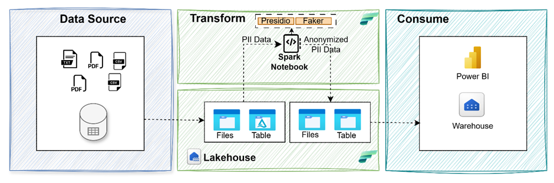
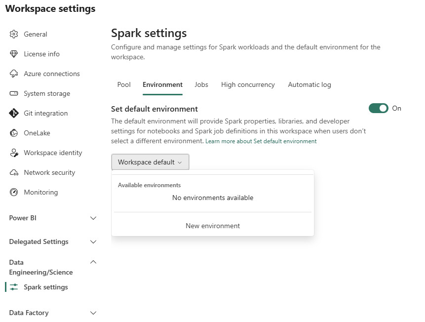
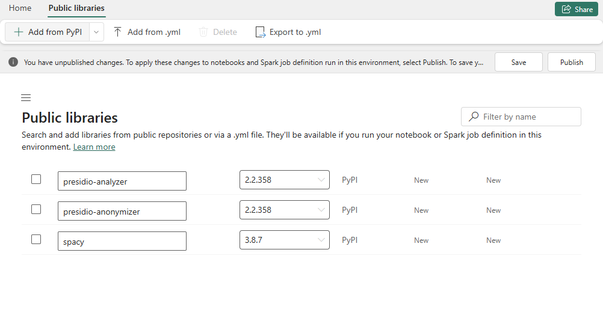
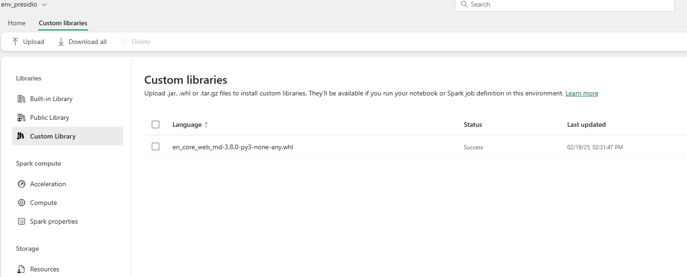

# 🔐 PII SparkShield

A PySpark-based repository for detecting and anonymizing Personally Identifiable Information (PII) using Microsoft Presidio, Faker, and Microsoft Fabric.



# 🚀 Features

- 🔍 PII Detection & redaction with Microsoft Presidio
- 🛡️ Anonymization via Masking, Hashing, and Encryption
- 🧪 Synthetic Data Generation using Faker
- ⚙️ Scalable on Microsoft Fabric (Lakehouse + Data Factory)

# 📁 Project Structure

- `notebooks/`: PySpark notebooks with step-by-step examples
- `data/`: Sample data
- `images`: Images used

---
There are multiple approaches to implementing data privacy at scale using  PySpark. This repository focuses specifically on the following three approaches using PySpark as processing engine.
1. [Identify and anonymizing PII in Structured and Unstructured Data Using Presidio](#identify-and-anonymizing-pii-in-structured-and-unstructured-data-using-presidio)
2. [Generate Synthetic Data Using Faker for Anonymization](#generate-synthetic-data-using-faker-for-anonymization)
3. [Use Built-in PySpark Functions for Hashing and Masking](#use-built-in-pyspark-functions-for-hashing-and-masking)

Each of these approaches are covered in detail in seperate folder

## Identify and anonymizing PII in Structured and Unstructured Data Using Presidio

### 📓 Notebooks
01_pii_detection_redaction_presidio.ipynb: Identify, Redact PII using Presidio

This notebook contains function designed to process DataFrames containing columns with potentially sensitive personally identifiable information (PII). It identifies and redacts PII by replacing detected entities with a placeholder text.

### Typical Use Cases
- **Unstructured Data** - Useful for processing columns extracted from unstructured sources such as `.txt` or `.pdf` files, where free-form text may contain PII.
- **Structured Data** - Can be applied to columns like comments, feedback, or notes in structured tables, where text fields may also include PII.

### How It Works?
- **Detection** - The method scans the specified column for PII entities using an NLP-based analyzer.
- **Redaction** - Detected PII is replaced with a placeholder (e.g., `"REDACTED"` or `"ANONYMIZED"`), ensuring sensitive information is not exposed.

## 🧰 Environment Setup
1. **Fabric workspace** with sufficient permissions to create and manage custom environments.
    1. Create a new Fabric lakehouse or use existing lakehouse within Fabric. Refer [this](https://learn.microsoft.com/en-us/fabric/data-engineering/tutorial-build-lakehouse#create-a-lakehouse) for more details.
    1. Create a folder "data" and subfolder "customer-profile-sample-data" in lakehouse. Download the sample data file from "customer-profile-sample-data" folder from [this](data/customer-profile-sample-data/) location and upload in the Lakehouse subfolder.
1. **Configure Spark Pool** Make sure to create (or select) a valid Spark pool that you can attach to your Fabric environment.
1. **Create a New Environment**
    1. In your Fabric workspace, go to "Workspace settings", "Data Engineering/Science","Spark settings","Environment" tab and select "New Environment".
    
    1. Provide a name (e.g., presidio-env)
1. **Add Dependencies**
    1. Under Public Library, add the below essential libraries:
    1. presidio-analyzer
    1. presidio-anonymizer
    1. spacy
    
        ```
        When using Microsoft Presidio with spaCy, you can choose between different spaCy model sizes such as en_core_web_md (medium, typically under 300MB) and en_core_web_lg (large, usually over 800MB).
        Medium (en_core_web_md): Contains word vectors, but these are smaller and less comprehensive than those in the large model. This model is designed to balance accuracy and resource usage.
        Large (en_core_web_lg) (Recommended): Includes much larger word vectors, which are used as features during prediction. This generally results in slightly better performance, especially for tasks that benefit from richer semantic information, but at the cost of increased memory and disk usage.
        ```
    1. For medium SpaCy models (like en_core_web_md < 300MB), you can include them directly in this environment.
    
    1. Upload a Large SpaCy Model
    If you want to use en_core_web_lg (which typically exceeds 300MB): 
        1. Create a folder "presidio" and within that, create a folder "models". Installing the large model from the lakehouse as it exceeds the size limit for custom libraries in the Fabric environment. Upload the .whl file to your Lakehouse (or any location accessible by Spark). The spaCy model can be downloaded from [here](https://spacy.io/models/en#en_core_web_lg).
        2. You will install it within the notebook rather than from this environment.
        This approach is necessary because the environment setup UI may restrict the size of packages you can add directly.
        
    1. Review Save & Publish
    Confirm your chosen libraries appear under the Custom Library or Public Library tabs.
    Click "Save" to finalize your environment setup.
    Click "Publish" to publish changes to the environment. (This may take time)

### Run the Sample Notebook
1. Open the 01_pii_detection_redaction_presidio.ipynb notebook
1. When opening your notebook, ensure you pick the custom environment you created.
1. Confirm you have selected the valid Spark pool you configured earlier.
1. Replace the location for "large model whl file" and "sample data file"
1. Run all cells


## Generate Synthetic Data Using Faker for Anonymization

### 📓 Notebooks
02_pii_detection_syntheticdatagen_presidio_faker.ipynb: Identify and replace PII data with synthetic data using Faker

This notebook contains function to identify PII data in Structured and Unstructured data using Presidio and generate Synthetic Data Using Faker for Anonymization

### Typical Use Cases
- **Unstructured Data** - Useful for processing columns extracted from unstructured sources such as `.txt` or `.pdf` files, where free-form text may contain PII.
- **Structured Data** - Can be applied to columns like comments, feedback, or notes in structured tables, where text fields may also include PII.

### How It Works?
- **Detection** - The method scans the specified column for PII entities using an NLP-based analyzer.
- **Replacement with synthetic data** - Detected PII is replaced with a synthetic data ensuring sensitive information is not exposed.

## 🧰 Environment Setup
Refer [environment setup](#-environment-setup)

### Run the Sample Notebook
1. Open the 02_pii_detection_syntheticdatagen_presidio_faker.ipynb notebook
1. When opening your notebook, ensure you pick the custom environment you created.
1. Confirm you have selected the valid Spark pool you configured earlier.
1. Replace the location for "large model whl file" and "sample data file"
1. Run all cells

## Use Built-in PySpark Functions for Hashing and Masking
This notebook contains samples to use PySpark's built-in functions for data hashing and masking
### Typical Use Cases
- **Structured Data** - Can be applied to columns like customer id,credit card,Phone number in structured tables.
### How It Works?
- Masking: Use complete or partially hide/mask data (e.g., mask all but the last 4 digits of a phone number).
- Hashing: Uses PySpark’s built-in sha2 function to compute the SHA-256 hash (hexadecimal string) for each value in the given column. (e.g. Customer ID is hashed).

### Run the Sample Notebook
1. Open the 03_PII_Hashing_Masking.ipynb notebook
1. Replace the location for "sample data file"
1. Run all cells

## Performance Optimization Techniques used in notebooks
1. Pandas UDFs (also known as vectorized UDFs) process data in batches using Pandas Series, which significantly reduces serialization overhead and leverages vectorized operations, making them much faster than standard Python UDFs—especially for large datasets
2. Broadcasting tells Spark to serialize the object only once, send it to each worker node once, and reuse it for all tasks on that node.This is especially important for large, read-only objects like NLP models or engines.
If you reference a Python object (like analyzer,anonymizer) directly inside a UDF, Spark will serialize and send a separate copy of that object to every worker and every task.

For heavy objects (like NLP models, which can be hundreds of MB), this is inefficient and can lead to:
- High memory usage
- Increased network traffic
- Slow job startup

---
## Limitations
Currently only support english
