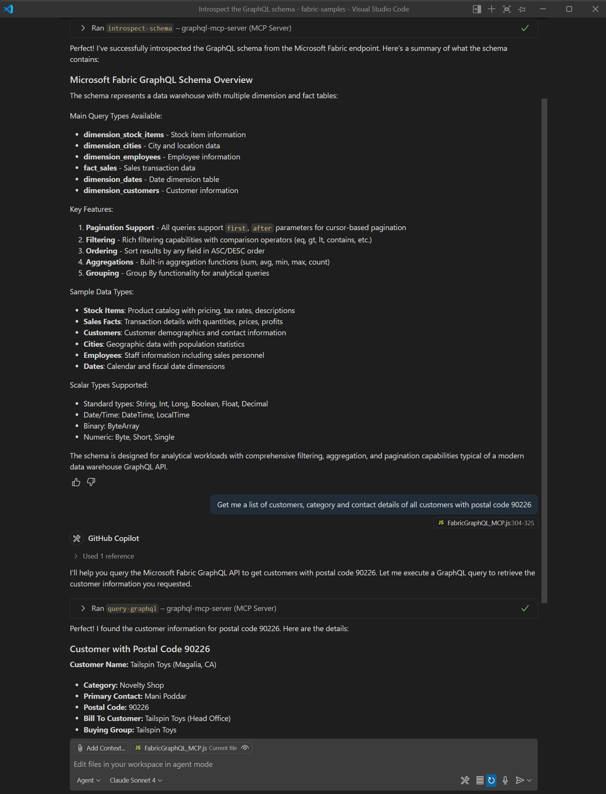

# MCP GraphQL Server

A Model Context Protocol (MCP) server for exposing GraphQL APIs as MCP tools. This server demonstrates how to bridge Microsoft Fabric GraphQL APIs to the MCP ecosystem, enabling natural language and programmatic access via MCP clients like GitHub Copilot.

> 
>
> _Screenshot: Retrieving a list of customers using the introspected Microsoft Fabric GraphQL API schema in VSCode with GitHub Copilot and MCP Server._

## Features

- Exposes GraphQL APIs as MCP tools
- Streamable HTTP implementation with Express, making it easier to use as a starting point for more complex client-server or web based integrations
- Supports schema introspection and arbitrary GraphQL queries
- Compatible with Cursor, Copilot, and any MCP client
- Logs all queries and variables sent to the backend API
- Minimal session management for MCP protocol compliance

> **Important Workflow Note:**
> Before issuing any queries, the MCP client must first run the `introspect-schema` tool to retrieve the GraphQL schema from the backend. Once the schema is retrieved, the `query-graphql` tool can be used to issue queries based on the introspected schema.

## Server Options

### 1. Microsoft Fabric GraphQL API Integration 

This server connects to a Microsoft Fabric GraphQL API using OAuth2 client credentials. Credentials and endpoint are provided via a `.env` file.

> **Important:**
>
> - You must configure Service Principal access for your Microsoft Entra app and Fabric workspace as described in the [official Microsoft documentation](https://learn.microsoft.com/en-us/fabric/data-engineering/api-graphql-service-principal). This includes enabling Service Principals in the Fabric Tenant Admin portal and granting the required permissions to your app.
> - **Introspection must be enabled on your Fabric GraphQL API for the MCP server to work.** By default, introspection is disabled and must be enabled by a Workspace Admin in the Fabric portal. For details, see the [Fabric API for GraphQL introspection and schema export documentation](https://learn.microsoft.com/en-us/fabric/data-engineering/api-graphql-introspection-schema-export).

#### Setup

1. **Install dependencies:**
   ```bash
   npm install
   ```
2. **Create a `.env` file in the project root or use/rename the `.env.template` file:**
   ```env
   MICROSOFT_FABRIC_API_URL=https://your-fabric-endpoint/graphql
   MICROSOFT_FABRIC_TENANT_ID=your_tenant_id_here
   MICROSOFT_FABRIC_CLIENT_ID=your_client_id_here
   MICROSOFT_FABRIC_CLIENT_SECRET=your_client_secret_here
   SCOPE=https://api.fabric.microsoft.com/.default
   ```
3. **Start the server:**
   ```bash
   node FabricGraphQL_MCP.js
   ```
   The server will listen on port 3000 in the `localhost` by default.

#### Notes

- The server will automatically obtain and refresh an access token for Microsoft Fabric.
- All requests to the Fabric API are authenticated.
- See [Microsoft's documentation](https://learn.microsoft.com/en-us/fabric/data-engineering/api-graphql-service-principal) for full details on configuring Service Principal access.
- See [Fabric API for GraphQL introspection and schema export](https://learn.microsoft.com/en-us/fabric/data-engineering/api-graphql-introspection-schema-export) for enabling introspection and exporting your schema.

## Endpoints

- **/mcp** — Main MCP endpoint for tool calls (JSON-RPC 2.0)
- **/health** — Check server status

## Available MCP Tools

### 1. `introspect-schema`

- **Description:** Retrieves the GraphQL schema from the backend endpoint.
- **Parameters:** None
- **Returns:** The full GraphQL schema as JSON

### 2. `query-graphql`

- **Description:** Executes a GraphQL query against the backend endpoint.
- **Parameters:**
  - `query` (string, required): The GraphQL query string
  - `variables` (object, optional): GraphQL variables
- **Returns:** The query result as JSON

## Usage Examples

### Using curl

**Introspect the schema:**

```bash
curl -X POST http://localhost:3000/mcp \
  -H "Content-Type: application/json" \
  -H "Accept: application/json, text/event-stream" \
  -d '{
    "jsonrpc": "2.0",
    "id": 1,
    "method": "tools/call",
    "params": {
      "name": "introspect-schema",
      "arguments": {}
    }
  }'
```

**Query example:**

```bash
curl -X POST http://localhost:3000/mcp \
  -H "Content-Type: application/json" \
  -H "Accept: application/json, text/event-stream" \
  -d '{
    "jsonrpc": "2.0",
    "id": 2,
    "method": "tools/call",
    "params": {
      "name": "query-graphql",
      "arguments": {
        "query": "query { dimension_stock_items(first: 10) { items { StockItemKey StockItem Color Brand UnitPrice } } }"
      }
    }
  }'
```

### Using VSCode with GitHub Copilot

1. **Install the [GitHub Copilot](https://marketplace.visualstudio.com/items?itemName=GitHub.copilot) extension in VSCode.**
2. **Add your MCP server as a tool in Copilot Labs (if available) or use a compatible MCP client extension.**
   ```JSON
   "graphql-mcp-server": {
      "type": "http",
      "url": "http://localhost:3000/mcp"
    }
   ```
3. **In the Copilot chat or command palette, type:**
   ```
   Show me all stock items with color, brand, and unit price
   ```
   or
   ```
   Use the query-graphql tool with: { "query": "query { dimension_stock_items(first: 10) { items { StockItemKey StockItem Color Brand UnitPrice } } }" }
   ```
4. **View the results in the Copilot chat or output panel.**

> **Note:** If you use a different MCP client extension for VSCode, follow its instructions to add the MCP server and invoke tools.

### Using Cursor

1. Add your MCP server in Cursor's MCP Tools:
   ```JSON
   "graphql-mcp-server": {
      "type": "http",
      "url": "http://localhost:3000/mcp"
    }
   ```
2. In the chat, type:
   ```
   Show me all stock items with color, brand, and unit price
   ```
   or
   ```
   Use the query-graphql tool with: { "query": "query { dimension_stock_items(first: 10) { items { StockItemKey StockItem Color Brand UnitPrice } } }" }
   ```
3. View the results in the chat.

## Customization

- For Microsoft Fabric, update your `.env` file with the correct credentials and endpoint.
- You can add more MCP tools by registering them with `server.tool`.

## Troubleshooting

- If you see errors about missing arguments, ensure your client sends the correct JSON-RPC payload.
- If using Cursor and tools are not recognized, restart Cursor and re-add the MCP server.
- All queries and variables sent to the backend API are logged in the server terminal for debugging.
- For Microsoft Fabric, ensure your Azure App Registration has the correct permissions and your `.env` values are correct.

## License

MIT
