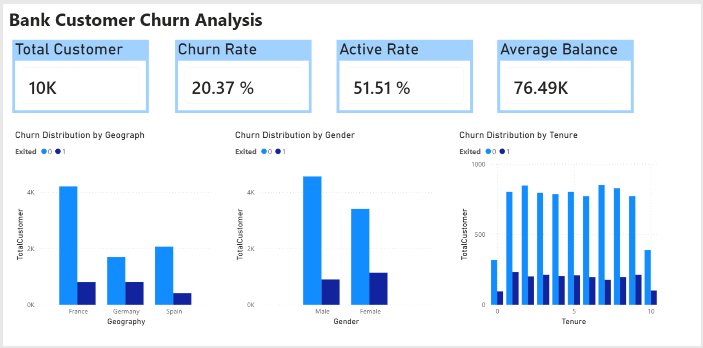
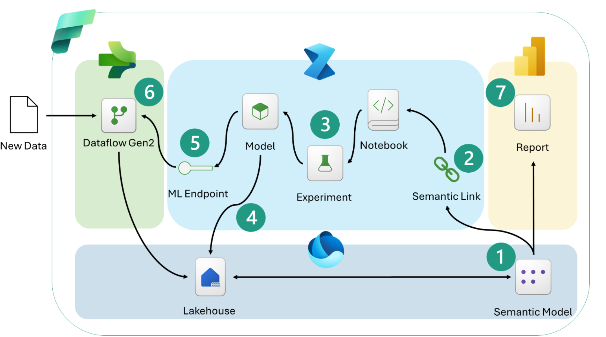

# Enrich Power BI reports with machine learning in Microsoft Fabric 
This sample shows an end‑to‑end pattern for enriching a Power BI report with machine learning in Fabric. We start with a governed semantic model, train a churn-prediction model, and operationalize predictions with batch and real‑time scoring. The result is predictive insight aligned with business logic, reliably refreshed, and surfaced directly in Power BI for monitoring, sharing, and action.

## Scenario: Predicting bank customer churn 

Across industries, teams use Power BI to understand what has already happened. Dashboards show trends, highlight performance, and keep organizations aligned around a shared view of the business. 

But leaders are asking new questions—not just what happened, but what is likely next and how outcomes might change if they act. They want insights that help teams prioritize, intervene earlier, and focus effort where it matters. This is why many organizations look to enrich Power BI reports with machine learning. 

This challenge is especially common in financial services. 

Consider a bank that uses Power BI to track customer activity, balances, and service usage. Historical analysis shows that around 20% of customers churn, with churn tied to factors such as customer tenure, product usage, service interactions, and balance changes. 

At this point, descriptive reporting is no longer enough. The real questions become:  

- Which customers are most likely to churn next? 
- How confident are those predictions? 
- Can churn risk update automatically as customer data changes? 
- Can accounts teams monitor high‑risk customers and act early? 

Microsoft Fabric makes it possible to answer those questions with a fully integrated, end-to-end workflow. 

## Architecture 

Let us first look at the architecture briefly: 

1. Semantic model defines business logic and metrics. 
2. Semantic Link to access that model directly from notebooks. 
3. Fabric ML experiment to train and evaluate a churn prediction model. 
4. Batch scoring applies to the model at scale and saves predictions to OneLake. 
5. Real-time scoring endpoints support low-latency inference where needed. 
6. Dataflow Gen2 calls the real-time scoring endpoint to enrich data during ingestion. 
7. Power BI Report visualizing churn risk and driving action. 

All components live natively in Fabric and share the same security, governance, and storage layer. 
