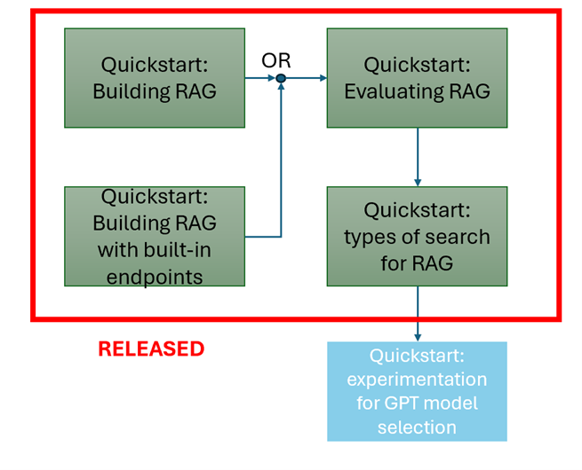

# Developing Retrieval-Augmented Generation Applications with Microsoft Fabric: A Practical Guide

This tutorial series provides a quickstart guide to help you use Microsoft Fabric for developing your Retrieval-Augmented Generation (RAG) applications. It includes three tutorials covering key aspects of building, evaluating, and optimizing RAG in Fabric.

### •	Tutorial 1: Building Retrieval Augmented Generation in Fabric
This tutorial walks you through the process of setting up a RAG pipeline in Fabric. You will learn how to connect your data sources, use Fabric’s tools for data retrieval, and integrate them with Azure OpenAI for generating responses based on the retrieved data.

### •	Tutorial 2: Evaluating the performance of RAG Applications on Fabric
Here, you will explore methods for evaluating the effectiveness of your RAG application. You will learn how to assess query accuracy, response quality, and overall system performance, enabling you to make data-driven improvements.

### •	Tutorial 3: Exploring Azure AI search in Fabric
In this tutorial, you will delve into Azure AI Search capabilities within Fabric. You'll learn how to use AI-powered search to enhance your RAG applications by efficiently retrieving relevant information from large datasets.

For the first tutorial, two options are available for using Azure OpenAI:

### •	Leverage Fabric's built-in Azure OpenAI endpoints:
You can use Fabric's native integration with Azure OpenAI without needing any subscription keys or resource IDs. This option simplifies the process, letting you focus on building your application.

### •	Bring-your-own-key:
If you already have an Azure OpenAI subscription, you can bring your own API keys to use within Fabric. This option provides flexibility for those who want more control over their OpenAI usage.

## Prerequisites

You need the following services to run this notebook.

- [Microsoft Fabric](https://aka.ms/fabric/getting-started)
- [Azure AI Studio for OpenAI](https://aka.ms/what-is-ai-studio)
- [Azure AI Search](https://aka.ms/azure-ai-search)

## Deployment Instructions

Follow these instructions [to import a notebook into Fabric](https://learn.microsoft.com/en-us/fabric/data-engineering/how-to-use-notebook). 

After uploading the notebook, you will need to ensure you have the following to insert into a cell for the remainder of the code to work.

### •	OpenAI Endpoint and Keys:
If you want to use your own Azure OpenAI subscription, you need the OpenAI endpoint along with the necessary API keys to enable the integration of generative AI within the notebook. This allows you to leverage OpenAI models for generating responses based on your data.

### •	Azure AI Search Endpoint and Keys:
Ensure you have access to Azure AI Search by providing the correct endpoint and API keys. This enables the notebook to retrieve relevant information efficiently from your dataset.
Once these resources are set up, use the provided [environment.yaml](environment.yaml) file to upload into Fabric. This will create, save, and publish a new [Fabric environment](https://learn.microsoft.com/en-us/fabric/data-engineering/create-and-use-environment). Be sure to select this environment before running the notebook.

## Modified CMU Question/Answer Dataset
This tutorial series uses a modified version of the CMU Question/Answer Dataset. Considering the original dataset has different licenses for S08/S09 and S10, the modified dataset has been created of only S08/S09 rows with a reference to the ExtractedPath. For simplicity, the data is cleaned up and refined into a single structured table with the following fields.

- ArticleTitle: the name of the Wikipedia article from which questions and answers initially came.
- Question: manually generated question based on article
- Answer: manually generated answer based on question and article
- DifficultyFromQuestioner: prescribed difficulty rating for the question as given to the question-writer
- DiffuctlyFromAnswerer: Difficulty rating assigned by the individual who evaluated and answered the question, which may differ from the difficulty from DifficultyFromQuestioner
- ExtractedPath: path to original article. There may be more than one Question-Answer pair per article
- text: cleaned wikipedia article

### History 
CMU Question/Answer Dataset, Release 1.2

8/23/2013

Noah A. Smith, Michael Heilman, and Rebecca Hw

Question Generation as a Competitive Undergraduate Course Project

In Proceedings of the NSF Workshop on the Question Generation Shared Task and Evaluation Challenge, Arlington, VA, September 2008. 
Available at: http://www.cs.cmu.edu/~nasmith/papers/smith+heilman+hwa.nsf08.pdf

Original dataset acknowledgements:

This research project was supported by NSF IIS-0713265 (to Smith), an NSF Graduate Research Fellowship (to Heilman), NSF IIS-0712810 and IIS-0745914 (to Hwa), and Institute of Education Sciences, U.S. Department of Education R305B040063 (to Carnegie Mellon).

cmu-qa-08-09 (modified verison)

6/12/2024

Amir Jafari, Alexandra Savelieva, Brice Chung, Hossein Khadivi Heris, Journey McDowell

Released under same license GFDL (http://www.gnu.org/licenses/fdl.html)
All the GNU license applies to the dataset in all copies.
