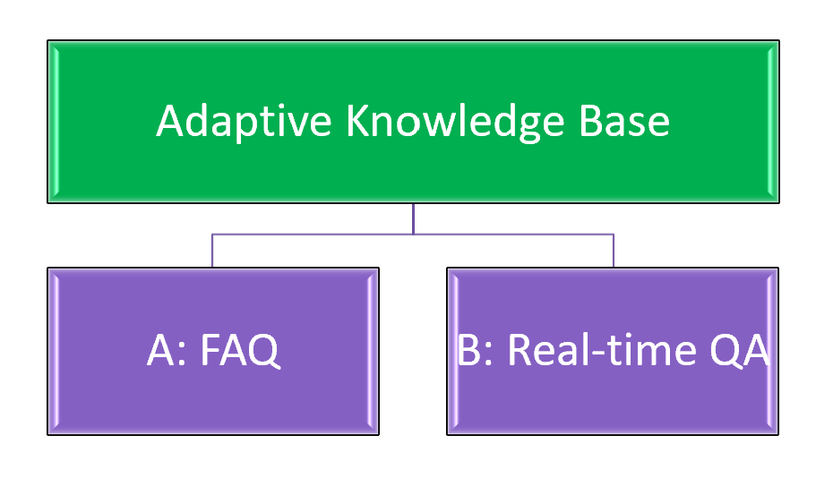

# Build an Adaptive Enterprise Knowledge Base for Powering your RAG with Microsoft Fabric: A Practical Guide

This tutorial provides a  guide to help you build advanced GenAI-powered applications from tribal conversational knowledge. 

It focuses on extracting knowledge from data of an online forum, which can be an instrumental pattern for automatically generating FAQ (frequently asked questions), an adaptive knowledge base for optimizing retrieval performance of a RAG system, or a benchmark.

For this tutorial, we use Fabric's native integration with Azure OpenAI without needing any subscription keys or resource IDs. This option simplifies the process, letting you focus on building your application.

If you already have an Azure OpenAI subscription, you may bring your own API keys to use within Fabric. This option provides flexibility for those who want more control over their OpenAI usage.

## Prerequisites

You need the following services to run this notebook.

- [Microsoft Fabric](https://aka.ms/fabric/getting-started) 

## Deployment Instructions

Follow these instructions [to import a notebook into Fabric](https://learn.microsoft.com/en-us/fabric/data-engineering/how-to-use-notebook). 

After uploading the notebook, you will need to ensure you have the following to insert into a cell for the remainder of the code to work.

## Synthetic Teams Dataset
This is a synthetic data for demonstrating how to process conversational data from GraphAPI at scale and extract insights, such as automatically build a FAQ for discussion forums, without exposing any real production data of Microsoft. 

LLM endpoint: Azure OpenAI GPT4o

Platform: Microsoft Fabric

Approach: we start with a set of N themes (human-defined); with LLM, generate a set of M questions randomly picking one of N themes at each iteration; for each question, generate a discussion thread.  

Themes: "Chemistry", "Hiking", "Cooking", "Watercolor", "Leadership", "Reading", and"Education"

Structure: GraphAPI (https://learn.microsoft.com/en-us/graph/teams-messaging-overview)

### History 
Insights from Teams conversations, Release 1.0

6/17/2025

Alexandra Savelieva, Journey McDowell
