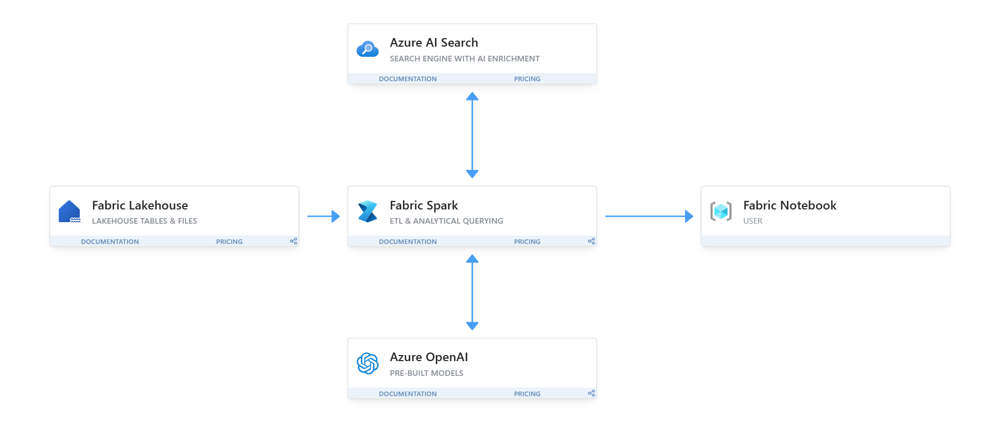

# Quickstart: Retrieval Augmented Generation with Azure AI Search, OpenAI, and Spark in Fabric on the CMU Queestion/Answer Dataset

As disruptive as Large Language Models (LLMs) like OpenAI's chatGPT are, there is still a need to specialize the Generative AI (GenAI) solution by leveraging custom data. You can try a simple approach to improve results by manually adding custom information in a prompt. A more difficult method to get better responses would be to fine tune the LLM with custom data. The strategy that will be demonstrated in this notebook is Retrieval Augmented Generation (RAG), which is dynamically providing additional and relevant information (e.g., data specific to your business) to ground the LLM with knowledge. 

RAG can be accomplished with searching websites, specific API, but a common method is to use a Vector Search Index for searching unstructured data in the form of text. The Vector Index consists of searching over a database of chunks of text and ranking the search by a score of how semantically similar the texts are to what the question is. Typically documents and articles are too large for embedding into a vector, so it is common practice to split the large text into chunks. The chunks are inserted into a Vector Index like Azure AI Search and then can be used for retrieval.

This notebook is meant to be a quickstart in Fabric for manipulating some data from [CMU's QA dataset](https://www.cs.cmu.edu/~ark/QA-data/) of Wikipedia articles using spark to take advantage of its pooling, demonstrate how to create a Vector Index using [Azure AI Search](https://learn.microsoft.com/en-us/azure/search/search-what-is-azure-search), and use an [OpenAI](https://learn.microsoft.com/en-us/azure/ai-services/openai/overview) LLM for answering based on the retrieved context.

Links for standing up services:
- [Azure AI Studio for OpenAI](https://learn.microsoft.com/en-us/azure/ai-studio/what-is-ai-studio)
- [Azure AI Search](https://learn.microsoft.com/en-us/azure/search/search-create-service-portal)
- [Microsoft Fabric](https://www.microsoft.com/en-us/microsoft-fabric/getting-started)

## Deployment Instructions

Follow these instructions [to import a notebook into Fabric](https://learn.microsoft.com/en-us/fabric/data-engineering/how-to-use-notebook). After uploading the notebook, you will need to ensure you have the following to insert into a cell for the remainder of the code to work.

- OpenAI endpoint and keys
- Azure AI Search endpoint and keys

Make sure to use the `environment.yaml` to upload into Fabric to create, save, and publish a [Fabric environment](https://learn.microsoft.com/en-us/fabric/data-engineering/create-and-use-environment). 

Then select the newly created environment before running the notebook.

## Modified CMU Question/Answer Dataset

Considering the original dataset has different licenses for S08/S09 and S10, the modified dataset has been created of only S08/S09 rows with a reference to the ExtractedPath. For simplicity, the data is cleaned up and refined into a single structured table with the following fields.

- ArticleTitle: the name of the Wikipedia article from which questions and answers initially came.
- Question: manually generated question based on article
- Answer: manually generated answer based on question and article
- DifficultyFromQuestioner: prescribed difficulty rating for the question as given to the question-writer
- DiffuctlyFromAnswerer: Difficulty rating assigned by the individual who evaluated and answered the question, which may differ from the difficulty from DifficultyFromQuestioner
- ExtractedPath: path to original article. There may be more than one Question-Answer pair per article
- text: cleaned wikipedia article

### History 
CMU Question/Answer Dataset, Release 1.2

8/23/2013

Noah A. Smith, Michael Heilman, and Rebecca Hw

Question Generation as a Competitive Undergraduate Course Project

In Proceedings of the NSF Workshop on the Question Generation Shared Task and Evaluation Challenge, Arlington, VA, September 2008. 
Available at: http://www.cs.cmu.edu/~nasmith/papers/smith+heilman+hwa.nsf08.pdf

Original dataset acknowledgements:

This research project was supported by NSF IIS-0713265 (to Smith), an NSF Graduate Research Fellowship (to Heilman), NSF IIS-0712810 and IIS-0745914 (to Hwa), and Institute of Education Sciences, U.S. Department of Education R305B040063 (to Carnegie Mellon).

cmu-qa-08-09 (modified verison)

6/12/2024

Amir Jafari, Alexandra Savelieva, Brice Chung, Hossein Khadivi Heris, Journey McDowell

Released under same license GFDL (http://www.gnu.org/licenses/fdl.html)
All the GNU license applies to the dataset in all copies.